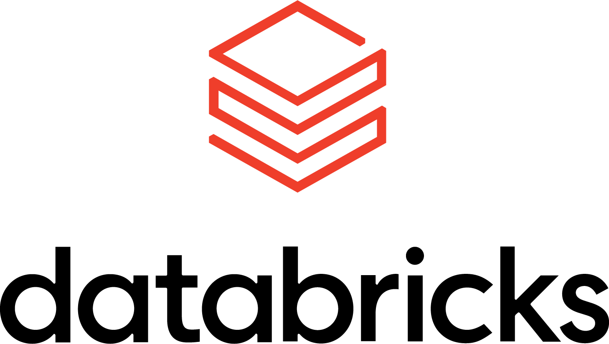
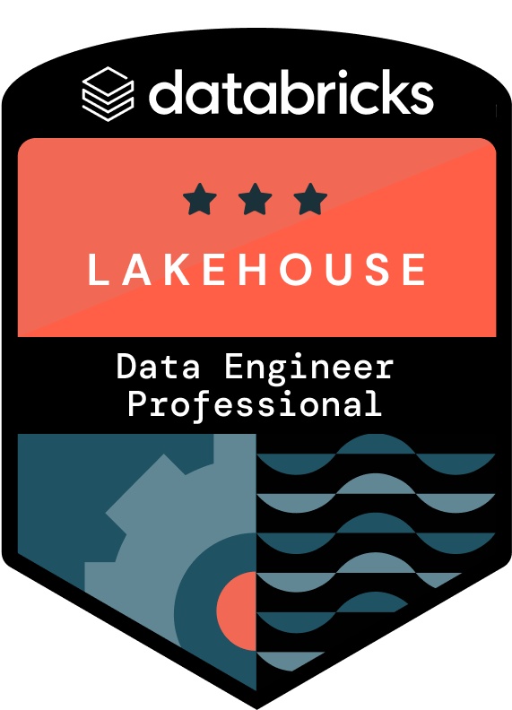
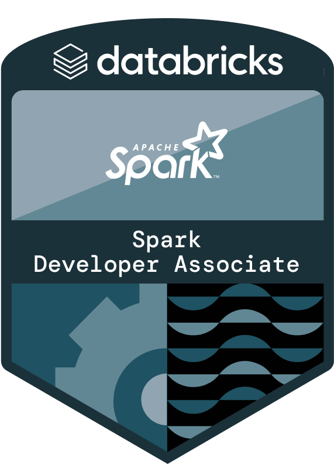
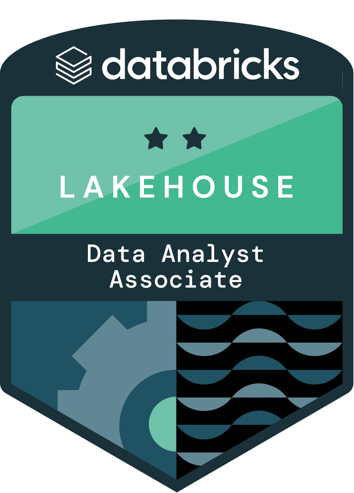
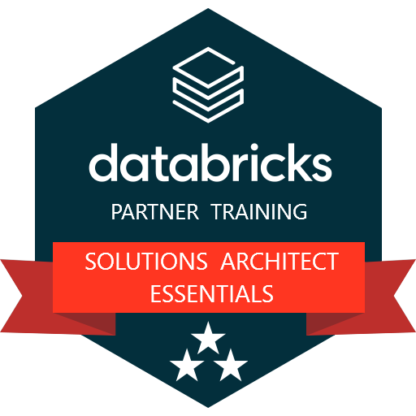
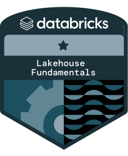

## Hi! I'm a Brazilian Data Engineer working around the world!    

Experience with data ingestion and pipelines in Big Data ecosystem on-premises and on-cloud, data lake and lakehouse storage, relational and noSQL databases, development with Python and Spark in object-oriented and functional projects, SQL and Shell, DataBricks and Azure platform.

I am graduated in Production Engineering, passionate about technology and programming and I have a data driven and goal oriented culture.
  

  <a href="https://github.com/otacilio-psf">
  
  

  
## Skills

  
  
  
  
  
  
  

## Certifications

 
 
 
 
 
 
 
  
  
  
  
  
  
 

##

 
  

